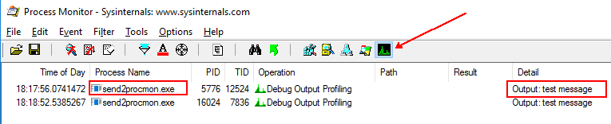
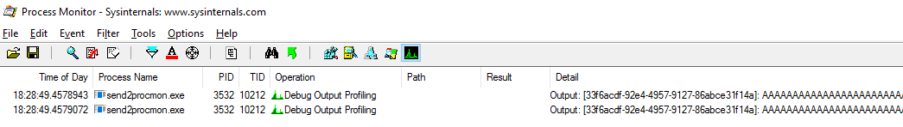

## Send2Procmon

Send2Procmon is a command line tool which sends its input data to a running Procmon instance. It's using the `\\.\Global\ProcmonDebugLogger` device, installed by Procmon. The input data will appear in Procmon as a Profiling event, with the message displayed in the Details column. The reporting process would be send2procmon.exe as can be seen on the screenshot below:



If a message to be sent is longer than 2047 characters, it will be split into smaller messages, with an activity id attached to the beginning of each message. This way you should be able to track the connected messages. For example a call like this:

```
PS> "A" * 2048 | .\send2procmon.exe
```

will generate output as follows:



